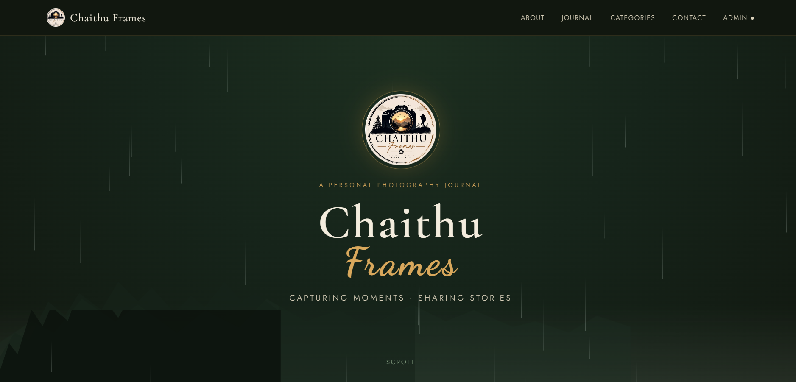
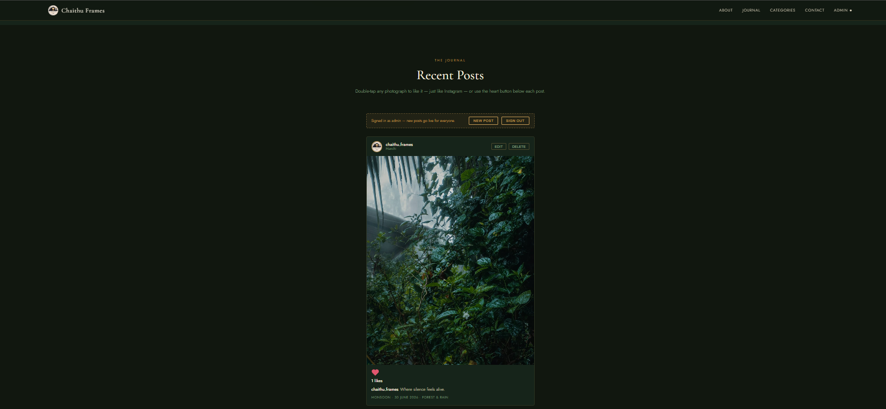
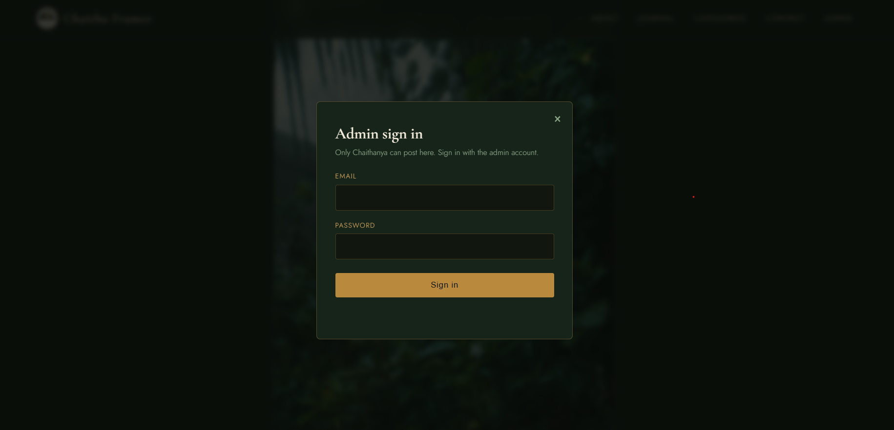

# 🌲 Chaithu Frames

**Capturing Moments. Sharing Stories.**

A personal photography blog built with HTML, CSS, JavaScript, and Firebase — a forest-and-rain themed journal where every photograph comes with the story behind it.

🔗 **Live site:** [https://YOUR-USERNAME.github.io/chaithu-frames/](https://YOUR-USERNAME.github.io/chaithu-frames/) <!-- replace with your real GitHub Pages link once it's live -->

---

## 📸 Screenshots

<!--
Add your screenshots below. Easiest way to do this on GitHub:
1. Open this README file on GitHub.com and click the pencil (Edit) icon.
2. Drag an image directly into the text box where you want it — GitHub
   uploads it automatically and inserts the markdown link for you.
3. Commit the change.

Or upload images to a folder named /screenshots in this repo, then
reference them like: 
-->

| Home / Hero | Journal Feed | Admin Panel |
|---|---|---|
|  |  |  |

---

## ✨ Features

- 🌲 Forest-and-rain themed design with animated rain and layered tree silhouettes
- 📸 Instagram-style photo feed — double-tap or use the heart button to like
- 🏷️ Clickable categories (Forest & Rain, Nature, Travel, Street, Portrait, Wildlife) that filter the journal
- 🔐 Admin login (Firebase Authentication) — only the site owner can publish
- ☁️ Posts stored live in Firebase Firestore, visible to every visitor in real time
- ✏️ Full CRUD for the admin: create, edit, and delete posts directly from the site
- 📱 Responsive design, works on mobile and desktop
- 🌙 Single-file site — no build step, no framework, just `index.html`

---

## 🛠️ Tech Stack

- HTML5, CSS3, JavaScript (ES6 modules)
- [Firebase Authentication](https://firebase.google.com/docs/auth) — admin sign-in
- [Firebase Firestore](https://firebase.google.com/docs/firestore) — stores posts and likes
- Photo hosting via [imgbb.com](https://imgbb.com) (free, no Firebase Storage / no billing required)
- Hosted on [GitHub Pages](https://pages.github.com/)

---

## 🚀 Getting Started (running your own copy)

1. **Clone or download this repo.**
2. **Create a Firebase project** at [console.firebase.google.com](https://console.firebase.google.com).
3. **Register a Web app** in your Firebase project (Project settings → Your apps → `</>`) and copy the `firebaseConfig` it gives you.
4. **Paste your config** into `index.html` — search for the `firebaseConfig` object near the bottom of the file and replace it with your own.
5. **Enable Firestore** (Build → Firestore Database → Create database → production mode).
6. **Enable Authentication** → Email/Password sign-in method → add yourself as a user under the **Users** tab.
7. **Set Firestore rules** so posts are publicly readable but only writable by a signed-in admin:
   ```
   rules_version = '2';
   service cloud.firestore {
     match /databases/{database}/documents {
       match /posts/{postId} {
         allow read: if true;
         allow create, update, delete: if request.auth != null;
       }
     }
   }
   ```
8. **Open `index.html`** in a browser, click **Admin**, sign in, and publish your first post.

To publish a photo, upload it to [imgbb.com](https://imgbb.com) first, copy the **direct image link** (ends in `.jpg`/`.png`), and paste that into the Photo URL field when posting.

---

## 📂 Project Structure

```
chaithu-frames/
│
├── index.html        ← everything: markup, styles, and Firebase logic
├── README.md          ← this file
└── screenshots/        ← add your own screenshots here
```

---

## 🌐 Deploying

This repo is set up to deploy with **GitHub Pages**:

1. Go to your repo's **Settings → Pages**.
2. Under "Build and deployment," set Source to **Deploy from a branch**.
3. Branch: `main`, folder: `/(root)`.
4. Save, wait a minute, and your live link will appear at the top of that page.

Don't forget to add your GitHub Pages domain (e.g. `your-username.github.io`) under **Firebase Console → Authentication → Settings → Authorized domains**, or admin sign-in will fail once you're live.

---

## 📬 Connect

- LinkedIn:(https://www.linkedin.com/in/chaithanya-094a71322)
- Instagram: [your Instagram link here]

---

© 2026 Chaithu Frames — Capturing Moments. Sharing Stories.
